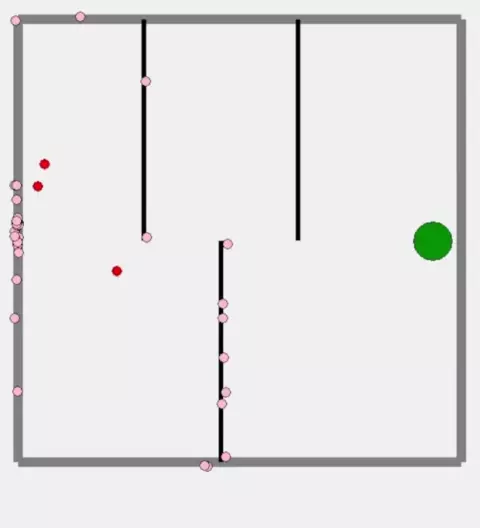

# CS481-GA-PathFinder

A simple pathfinding algorithm that uses a genetic algorithm to find the shortest path between two points, avoiding obstacles.

## How to use

1. Clone the repository and `cd` into it
2. Run `poetry install` to install dependencies
3. Run `poetry run pathfinder` to run the program
